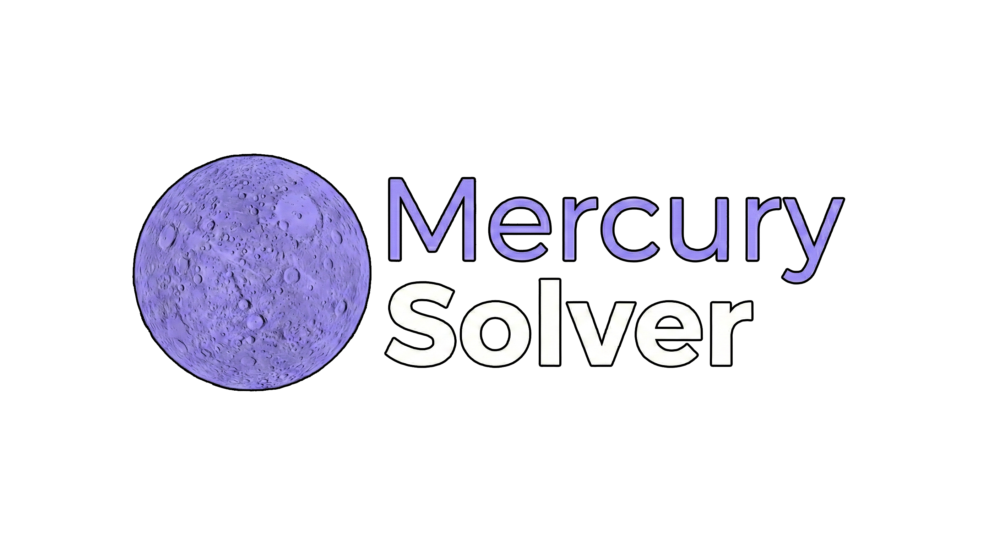

<div align="center">
  
  
  <h3>An AI-powered Math, Physics, and Statistics Solver<br/><i>Un solucionador impulsado por IA para Matemáticas, Física y Estadística</i></h3>

  <p>
    <a href="#english">English</a> •
    <a href="#español">Español</a>
  </p>
</div>

---

<h2 id="english">🇬🇧 English</h2>

**Mercury Solver** is an advanced web application designed strictly as a robotic mathematical and algorithmic solver. Powered by the Google Gemini AI, it interprets complex equations, parses images and PDFs, and responds exclusively with pure mathematical steps using LaTeX formatting.

### ✨ Features
- **Strictly Mathematical:** Configured to avoid conversational filler, greetings, or off-topic discussions. It only outputs mathematical steps and the final answer.
- **LaTeX Rendering:** Full support for rendering complex mathematical equations via `react-markdown` and `rehype-katex`.
- **Image & PDF Recognition:** Drag and drop or paste images/PDFs directly into the chat to have the AI solve handwritten or printed problems.
- **Custom Math Keyboard:** Built-in floating keyboard for inserting specialized math symbols easily.
- **Responsive UI:** Modern, clean styling with dark/light modes and responsive sidebar navigation.

### 🛠️ Tech Stack
- **Frontend:** React 19, Vite, Vanilla CSS.
- **Backend:** Node.js, Express (for local development) & Vercel Serverless Functions (`api/chat.js` for production).
- **AI Integration:** `@google/genai` (Gemini 2.0 Flash).
- **Markdown & Math Processing:** `react-markdown`, `remark-math`, `rehype-katex`, `remark-gfm`.

### 🚀 Getting Started

1. **Clone the repository**
2. **Install dependencies:**
   ```bash
   npm install
   ```
3. **Set up Environment Variables:**
   Create a `.env` file in the root directory and add your Gemini API Key:
   ```env
   GEMINI_API_KEY=your_api_key_here
   GEMINI_MODEL=gemini-2.0-flash
   ```
4. **Run the development server:**
   ```bash
   npm run dev
   ```
   This will start both the Vite frontend and the local Express server concurrently.

---

<h2 id="español">🇪🇸 Español</h2>

**Mercury Solver** es una aplicación web avanzada diseñada estrictamente como un solucionador matemático y algorítmico robótico. Impulsada por la IA de Google Gemini, interpreta ecuaciones complejas, procesa imágenes y PDFs, y responde de manera exclusiva con los pasos matemáticos puros utilizando formato LaTeX.

### ✨ Características
- **Estrictamente Matemático:** Configurado para evitar diálogos de relleno, saludos o discusiones fuera de tema. Solamente devuelve los pasos matemáticos y el resultado final.
- **Renderizado LaTeX:** Soporte completo para renderizar ecuaciones matemáticas complejas a través de `react-markdown` y `rehype-katex`.
- **Reconocimiento de Imágenes y PDF:** Arrastra y suelta o pega imágenes/PDFs directamente en el chat para que la IA resuelva problemas impresos o escritos a mano.
- **Teclado Matemático Integrado:** Teclado flotante para insertar fácilmente símbolos matemáticos especializados.
- **Interfaz Moderna:** Estilo limpio con soporte para modos claro/oscuro y navegación lateral responsiva.

### 🛠️ Tecnologías Usadas
- **Frontend:** React 19, Vite, Vanilla CSS.
- **Backend:** Node.js, Express (para desarrollo local) y Vercel Serverless Functions (`api/chat.js` para producción).
- **Integración IA:** `@google/genai` (Gemini 2.0 Flash).
- **Procesamiento de Markdown y Matemáticas:** `react-markdown`, `remark-math`, `rehype-katex`, `remark-gfm`.

### 🚀 Instalación y Uso

1. **Clona el repositorio**
2. **Instala las dependencias:**
   ```bash
   npm install
   ```
3. **Configura las Variables de Entorno:**
   Crea un archivo `.env` en el directorio raíz y añade tu clave API de Gemini:
   ```env
   GEMINI_API_KEY=tu_api_key_aqui
   GEMINI_MODEL=gemini-2.0-flash
   ```
4. **Ejecuta el servidor de desarrollo:**
   ```bash
   npm run dev
   ```
   Esta acción iniciará de forma simultánea el frontend de Vite y el servidor local de Node.js.
