  
  
  <h3>An AI-powered Math, Physics, and Statistics Solver <i>Un solucionador impulsado por IA para Matemáticas, Física y Estadística</i></h3>

  

    <a href="#español">Español</a> •
    <a href="#english">English</a>
  

---

## 🇪🇸 Español

**Mercury Solver** es una aplicación web avanzada diseñada estrictamente como un solucionador matemático y algorítmico robótico. Impulsada por la IA de Google Gemini, interpreta ecuaciones complejas, procesa imágenes y PDFs, y responde de manera exclusiva con los pasos matemáticos puros utilizando formato LaTeX.

### 🌐 Aplicación en Vivo
La aplicación ya está desplegada y lista para usar. Puedes acceder directamente en:  
**[https://mercurysolver.vercel.app/](https://mercurysolver.vercel.app/)**

### ✨ Características Principales
- **Estrictamente Matemático:** Configurado para evitar diálogos de relleno, saludos o discusiones fuera de tema. Solamente devuelve los pasos matemáticos y el resultado final.
- **Renderizado LaTeX:** Soporte completo para renderizar ecuaciones matemáticas complejas a través de `react-markdown` y `rehype-katex`.
- **Reconocimiento de Imágenes y PDF:** Arrastra y suelta o pega imágenes/PDFs directamente en el chat para que la IA resuelva problemas impresos o escritos a mano.
- **Teclado Matemático Integrado:** Teclado flotante para insertar fácilmente símbolos matemáticos especializados.
- **Interfaz Moderna:** Estilo limpio con soporte para modos claro/oscuro y navegación lateral responsiva.

### 🛠️ Stack Tecnológico
- **Frontend:** React 19, Vite, Vanilla CSS.
- **Backend:** Vercel Serverless Functions (`api/chat.js` para producción) y Node.js.
- **Integración IA:** `@google/genai` (Gemini 2.5 Flash).
- **Procesamiento de Markdown y Matemáticas:** `react-markdown`, `remark-math`, `rehype-katex`, `remark-gfm`.

---

## 🇬🇧 English

**Mercury Solver** is an advanced web application designed strictly as a robotic mathematical and algorithmic solver. Powered by the Google Gemini AI, it interprets complex equations, parses images and PDFs, and responds exclusively with pure mathematical steps using LaTeX formatting.

### 🌐 Live Application
The application is deployed and ready to use. You can access it directly at:  
**[https://mercurysolver.vercel.app/](https://mercurysolver.vercel.app/)**

### ✨ Key Features
- **Strictly Mathematical:** Configured to avoid conversational filler, greetings, or off-topic discussions. It only outputs mathematical steps and the final answer.
- **LaTeX Rendering:** Full support for rendering complex mathematical equations via `react-markdown` and `rehype-katex`.
- **Image & PDF Recognition:** Drag and drop or paste images/PDFs directly into the chat to have the AI solve handwritten or printed problems.
- **Custom Math Keyboard:** Built-in floating keyboard for inserting specialized math symbols easily.
- **Responsive UI:** Modern, clean styling with dark/light modes and responsive sidebar navigation.

### 🛠️ Tech Stack
- **Frontend:** React 19, Vite, Vanilla CSS.
- **Backend:** Vercel Serverless Functions (`api/chat.js` for production) & Node.js.
- **AI Integration:** `@google/genai` (Gemini 2.5 Flash).
- **Markdown & Math Processing:** `react-markdown`, `remark-math`, `rehype-katex`, `remark-gfm`.
